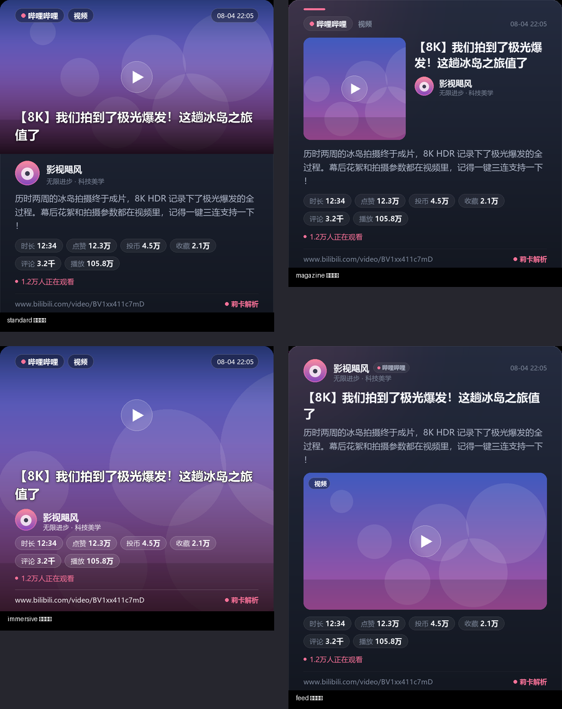
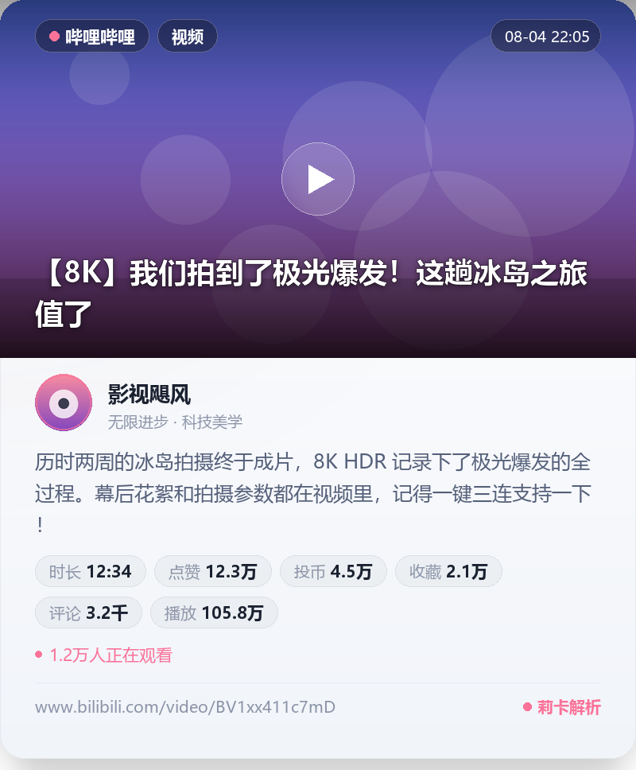

# 莉卡解析 (astrbot_plugin_rika_share)


**莉卡解析** 是一款专为 [AstrBot](https://github.com/Soulter/AstrBot) 打造的高能链接自动解析与媒体下载插件。移植自 [nonebot-plugin-parser](https://github.com/fllesser/nonebot-plugin-parser)，并针对 AstrBot 架构进行了深度重构与功能增强。

---

## ✨ 核心亮点

- 🚀 **多平台自动解析**：自动识别聊天中的链接与 JSON 分享卡片，提取标题、正文、作者、数据统计、图集及无水印视频。
- 🔑 **B站扫码登录 & Cookie 自动化监控**：
  - **无需抓包**：聊天框直接发送 `/bili_login` 即可生成动态二维码，扫码确认自动完成登录。
  - **加密持久化**：Cookie 使用 AES/Fernet 加密保存，重启不丢失。
  - **健康度监控**：后台定时轮询检测 Cookie 有效性，检测到失效/恢复时自动通知指定管理员。
  - **无缝自动应用**：扫码成功后自动注入解析引擎，无需手动重载配置。
- 🎨 **Pillow 纯 Headless 渲染**：
  - **无浏览器依赖**：使用 Python Pillow 库高性能无头渲染，毫秒级输出。
  - **4 种现代卡片布局**：支持 `standard`（标准横幅）、`magazine`（双栏杂志）、`immersive`（沉浸全屏）、`feed`（社交动态）。
  - **深/浅双主题**：支持 `dark` 与 `light` 配色模式、全尺寸封面模式、品牌光晕与毛玻璃徽章。
- 🌐 **Cloudflare 网页截图 Fallback**：
  - 未匹配到任何已有平台的常规网页链接，可自动调用 Cloudflare Browser Rendering API 渲染网页截图发送。
  - 支持自定义视窗、清晰度倍率 (deviceScaleFactor)、CSS 元素截取、Cookie/Header 注入及黑名单过滤。
- ⚡ **跨平台适配器自动优化**：
  - **OneBot v11**：自动构建优雅的节点合并转发（Nodes），避免消息刷屏。
  - **QQ Official / Telegram 等**：自动拆分兼容量，采用主动发送机制，防止消息被 `@` 回复格式干扰。

---

## 🌐 支持平台矩阵

| 平台 | 覆盖类型 | 媒体/文件下载 | 平台特色与备注 |
| :--- | :--- | :--- | :--- |
| **哔哩哔哩 (Bilibili)** | 视频 / 动态 / 图文(Opus) / 直播 / 专栏 / 收藏夹 | 高清视频（支持 1080P/4K/8K）、封面、图集 | 支持 `/bili_login` 扫码登录、自动监控与高清视频下载 |
| **抖音 (Douyin)** | 视频 / 图文动态 | 无水印视频、高清图集 | 支持短链解析、封面自动提取 |
| **快手 (Kuaishou)** | 视频 / 图文 | 无水印视频、高清图片 | 支持短链与网页链接 |
| **微博 (Weibo)** | 微博动态 / 文章 / 视频 | 原图图集、无水印视频 | 支持多图网格、转发引用结构提取 |
| **小红书 (Xiaohongshu)** | 图文笔记 / 视频笔记 | 原图无水印图集、视频 | 支持 `XHS_CK` 鉴权与水印去除 |
| **Twitter / X** | 推文 / 媒体 | 高清图片、视频 | 支持 `x.com` 链接解析 |
| **AcFun (A站)** | 视频 | 视频文件 | 基础视频解析 |
| **NGA 论坛** | 帖子内容 / 主题 | 帖子正文与图集 | 论坛内容快速展示 |
| **通用网页 (Cloudflare)** | 任意 HTTP/HTTPS 网页 | 网页高清无头截图 | 需开通 Cloudflare Browser Rendering 兜底 |

---

## 🎨 精美解析卡片渲染

开启 `RENDER_ENABLED` 后，解析结果将无头渲染为现代视觉风格的分享卡片图片单独发送，带来极佳的视觉体验。

### 布局展示



插件提供 4 种自由切换的卡片布局：

| 布局名称 (`RENDER_LAYOUT`) | 布局特点与适用场景 |
| :--- | :--- |
| **`standard` 标准横幅** *(默认)* | 顶部全宽封面横幅 + 纵向信息流，视觉大气平衡，适合绝大多数视频与动态。 |
| **`magazine` 双栏杂志** | 封面紧凑收纳于左侧，标题与作者信息至于右侧，适合长文本及文章。 |
| **`immersive` 沉浸全屏** | 封面高斯模糊+铺满整卡，文字浮于渐变 Dark Scrim 遮罩上（无图时自动回退 standard）。 |
| **`feed` 社交动态** | 作者头像与信息行置顶，媒体块内嵌为圆角多图/单图，原生 App 社交流风格。 |

### 主题风格

支持 **深色 (`dark`)** 与 **浅色 (`light`)** 两套配色：



> 💡 **提示**：Linux 服务器环境建议安装中文字体（如 `apt install fonts-noto-cjk`），或在配置 `RENDER_FONT_PATH` 中手动指定 `.ttf/.otf` 字体文件，避免卡片文字显示为方块。

---

## 🛠️ 指令说明

插件内置管理员专属的 B站 Cookie 运维指令：

| 指令 | 权限要求 | 功能说明 |
| :--- | :--- | :--- |
| `/bili_login` | **ADMIN** | 启动 B站 扫码登录流程。机器人将生成并发送二维码图片，扫码确认后自动保存密钥并启用 Cookie。 |
| `/bili_check` | 所有人 / ADMIN | 手动检测当前 B站 Cookie 的有效性，显示用户昵称、UID 及会员状态。 |
| `/bili_status` | 所有人 / ADMIN | 查看当前 B站 Cookie 状态以及后台健康监控任务的运行状态。 |

---

## ⚙️ 配置说明

在 AstrBot 管理面板 WebUI 中，配置已按逻辑划分为 7 大分组：

### 1. 平台设置
| 配置项 | 类型 | 默认值 | 说明 |
| :--- | :--- | :--- | :--- |
| `DISABLED_PLATFORMS` | string | `""` | 禁用的平台（逗号分隔，例如 `acfun,nga`，留空表示全部启用） |
| `VIDEO_DURATION_MAXIMUM` | int | `480` | 视频/音频最大解析时长（秒），超出此时长的视频将不下载视频文件 |
| `XHS_CK` | string | `""` | 小红书 Cookie（可选，填入后可解析/下载小红书高清视频与图集） |

### 2. B站设置
| 配置项 | 类型 | 默认值 | 说明 |
| :--- | :--- | :--- | :--- |
| `BILI_CK` | string | `""` | B站 Cookie (SESSDATA)。*建议直接使用 `/bili_login` 扫码登录自动填入* |
| `BILI_QUALITY` | string | `"1080P"` | B站视频下载清晰度，可选: `360P`, `480P`, `720P`, `1080P`, `1080P+`, `4K`, `8K` (需账号权限) |
| `BILI_COOKIE_MONITOR_ENABLED` | bool | `true` | 是否启用 B站 Cookie 定时监控 |
| `BILI_COOKIE_CHECK_INTERVAL` | int | `3600` | Cookie 状态检测间隔时间（秒，最小 60 秒） |
| `BILI_NOTIFY_USER_ID` | string | `""` | Cookie 失效/恢复时接收通知的 QQ 号或 UserID（留空仅打印日志） |

### 3. 缓存设置
| 配置项 | 类型 | 默认值 | 说明 |
| :--- | :--- | :--- | :--- |
| `CACHE_TTL_HOURS` | int | `24` | 缓存过期清理时间（小时）。设为 `0` 禁用自动清理 |
| `CACHE_CLEANUP_INTERVAL_MINUTES` | int | `60` | 缓存清理定时检查间隔（分钟） |

### 4. 解析图片渲染
| 配置项 | 类型 | 默认值 | 说明 |
| :--- | :--- | :--- | :--- |
| `RENDER_ENABLED` | bool | `true` | 是否启用 Pillow 解析图片渲染（失败自动降级为文本形式） |
| `RENDER_THEME` | string | `"dark"` | 卡片主题，可选：`dark`（深色） / `light`（浅色） |
| `RENDER_LAYOUT` | string | `"standard"` | 卡片布局，可选：`standard` / `magazine` / `immersive` / `feed` |
| `RENDER_WIDTH` | int | `800` | 卡片图片像素宽度（范围 520 - 1080px） |
| `RENDER_COVER_FULL_SIZE` | bool | `false` | 开启后封面完整显示原始宽高比，不进行中心裁剪 |
| `RENDER_FONT_PATH` | string | `""` | 自定义字体文件/目录路径（.ttf/.ttc/.otf），留空自动探测系统字体 |

### 5. Cloudflare 基础设置 (网页截图 Fallback)
| 配置项 | 类型 | 默认值 | 说明 |
| :--- | :--- | :--- | :--- |
| `CLOUDFLARE_FALLBACK_ENABLED` | bool | `false` | 启用通用链接网页截图兜底（未匹配已知适配器时触发） |
| `CLOUDFLARE_ACCOUNT_ID` | string | `""` | Cloudflare 账号 ID (需开通 Browser Rendering 服务) |
| `CLOUDFLARE_API_TOKEN` | string | `""` | Cloudflare API Token (需具备 Browser Rendering - Edit 权限) |
| `CLOUDFLARE_TIMEOUT` | int | `60` | 截图 API 请求超时时间（秒） |
| `CLOUDFLARE_CACHE_TTL` | int | `0` | 截图缓存 TTL（秒），`0` 表示不缓存每次重新渲染 |
| `CLOUDFLARE_BLACKLIST` | list | `[]` | 截图黑名单规则（支持完整域名、`*.example.com` 通配符、路径前缀或无点关键词） |

### 6. Cloudflare 截图高级设置
| 配置项 | 类型 | 默认值 | 说明 |
| :--- | :--- | :--- | :--- |
| `CLOUDFLARE_VIEWPORT_WIDTH` / `HEIGHT` | int | `1280` / `720` | 无头浏览器视窗宽度与高度 |
| `CLOUDFLARE_DEVICE_SCALE_FACTOR` | float | `1.0` | 截图清晰度缩放倍率（推荐 1.0~3.0，增大可消除大屏模糊） |
| `CLOUDFLARE_WAIT_UNTIL` | string | `"networkidle0"` | 页面加载等待策略：`load` / `domcontentloaded` / `networkidle0` / `networkidle2` |
| `CLOUDFLARE_FULL_PAGE` | bool | `false` | 是否截取完整长图（包含滚动区域） |
| `CLOUDFLARE_SELECTOR` | string | `""` | 指定截取的 CSS 选择器（如 `#content`），留空截取整页 |
| `CLOUDFLARE_WAIT_FOR_SELECTOR` | string | `""` | 等待指定 CSS 选择器元素出现后再截图（适合 SPA 动态渲染页） |
| `CLOUDFLARE_SCREENSHOT_TYPE` | string | `"png"` | 截图格式，可选：`png` / `jpeg` |
| `CLOUDFLARE_EXTRA_HEADERS` | JSON | `""` | 请求附加 HTTP Header (JSON 对象格式) |
| `CLOUDFLARE_COOKIES` | JSON | `""` | 页面附加 Cookie (JSON 数组格式) |

### 7. 调试设置
| 配置项 | 类型 | 默认值 | 说明 |
| :--- | :--- | :--- | :--- |
| `DEBUG_LOG_ENABLED` | bool | `true` | 是否启用详细错误调试日志 |

---

## 📦 安装与部署

1. **获取插件代码**：
   将 `astrbot_plugin_rika_share` 文件夹放入 AstrBot 的 `data/plugins/` 目录中。

2. **安装依赖**：
   在插件根目录下运行依赖安装：
   ```bash
   pip install -r requirements.txt
   ```
   *插件核心依赖包括 `aiohttp`, `qrcode`, `cryptography`, `pillow`, `pydantic` 等。*

3. **启用插件**：
   重启 AstrBot 并在管理面板 WebUI 中启用 `莉卡解析`。

---

## 🔐 Cookie 获取指南

### 方式一：B站扫码登录 (极力推荐 ⭐⭐⭐⭐⭐)
1. 在配置的管理员账号下，直接向机器人发送指令 `/bili_login`。
2. 机器人将发送一张登录二维码图片。
3. 打开手机 **B站 App** 扫描该二维码，并点击 **确认登录**。
4. 机器人提示登录成功后，Cookie 会**加密保存并自动生效**，无需重启！

### 方式二：手动配置 B站 SESSDATA
1. 使用电脑浏览器登录 [bilibili.com](https://www.bilibili.com)。
2. 按 `F12` 打开开发者工具，切换到 `Application` (应用) -> `Cookies`。
3. 找到 `SESSDATA` 项，复制其 Value 值。
4. 填入插件配置项中的 `BILI_CK`。

### 方式三：小红书 Cookie 配置
1. 使用电脑浏览器登录 [xiaohongshu.com](https://www.xiaohongshu.com)。
2. 按 `F12` 打开开发者工具，在控制台 (Console) 中输入 `document.cookie` 并回车。
3. 复制打印出的完整 Cookie 字符串，填入插件配置项中的 `XHS_CK`。

---

## 📁 目录结构

```text
astrbot_plugin_rika_share/
├── main.py                    # 插件主入口 (事件响应、B站扫码登录/监控、Fallback路由)
├── metadata.yaml              # 插件元数据定义
├── _conf_schema.json          # WebUI 配置项分组 Schema 定义
├── requirements.txt           # Python 依赖清单
├── docs/
│   └── previews/              # 卡片渲染与布局预览图
├── scripts/
│   └── preview_layouts.py     # 布局渲染测试回归脚本
└── core/
    ├── config.py              # 配置读取与旧版配置自动迁移
    ├── constants.py           # 常量与枚举
    ├── data.py                # ParseResult 等核心数据模型
    ├── download.py            # 异步流式下载器 (支持进度与限速)
    ├── render.py              # Pillow 卡片渲染引擎
    ├── cloudflare_screenshot.py# Cloudflare Browser Rendering API 客户端
    ├── bili_models/           # B站各种消息模型解析
    └── parsers/               # 各平台解析适配器
        ├── bilibili.py        # B站解析器
        ├── douyin.py          # 抖音解析器
        ├── kuaishou.py        # 快手解析器
        ├── weibo.py           # 微博解析器
        ├── xiaohongshu.py     # 小红书解析器
        ├── twitter.py         # Twitter/X 解析器
        ├── nga.py             # NGA 解析器
        └── acfun.py           # AcFun 解析器
```

---

## 🙏 致谢

- [nonebot-plugin-parser](https://github.com/fllesser/nonebot-plugin-parser) — 感谢原 NoneBot2 插件作者的优秀思路与解析库逻辑。
- [AstrBot](https://github.com/Soulter/AstrBot) — 强大的多平台 AI 机器人框架。

---

## 📄 开源许可

本项目遵循 MIT 许可证。
